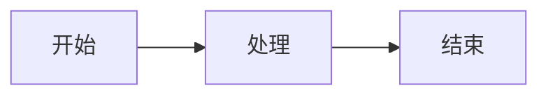

# Hexo文档库使用指南

本文档库基于Hexo静态网站生成器，使用prontera主题，并配置了自动GitHub同步。

## 📚 基本信息

- **在线地址**: http://172.238.20.139
- **GitHub仓库**: https://github.com/lolgigeo/openclaw-log
- **主题**: [prontera](https://github.com/AngryPowman/hexo-theme-prontera)
- **文档目录**: `~/docs-hexo/source/_posts/`

## 📝 添加新文档

### 1. 创建文档文件

在 `~/docs-hexo/source/_posts/` 目录下创建新的Markdown文件，必须包含Front Matter：

```markdown
---
title: 文档标题
date: 2026-02-06 08:00:00
categories:
  - 分类名称
tags:
  - 标签1
  - 标签2
---

# 文档内容开始...
```

### 2. 生成静态网站

```bash
cd ~/docs-hexo
npx hexo generate
```

### 3. 自动推送到GitHub

- **自动方式**: Cron任务每10分钟自动检查并推送
- **手动方式**: 运行 `~/docs-hexo/auto-push.sh`

## 🎨 支持的功能

### Mermaid图表

支持Mermaid语法绘制流程图、序列图等：



### 分类和标签

- **分类**: 适用于大的主题分组（如：架构、金融分析、开发）
- **标签**: 适用于细粒度的主题标记（如：Git、NASDAQ、技术栈）

访问：
- 分类页面: http://172.238.20.139/categories/
- 标签页面: http://172.238.20.139/tags/
- 归档页面: http://172.238.20.139/archives/

## 🔧 常用命令

### 新建文章

```bash
cd ~/docs-hexo
npx hexo new "文章标题"
```

### 生成静态文件

```bash
cd ~/docs-hexo
npx hexo generate
# 或简写
npx hexo g
```

### 清理缓存

```bash
cd ~/docs-hexo
npx hexo clean
```

### 本地预览

```bash
cd ~/docs-hexo
npx hexo server -p 4000
# 访问 http://localhost:4000
```

## 🚀 自动化机制

### 自动推送GitHub

**脚本位置**: `~/docs-hexo/auto-push.sh`

**Cron配置**:
```cron
*/10 * * * * /root/docs-hexo/auto-push.sh >> /root/docs-hexo/auto-push.log 2>&1
```

**查看推送日志**:
```bash
tail -f ~/docs-hexo/auto-push.log
```

### Nginx静态文件服务

**配置文件**: `/etc/nginx/sites-available/docs-hexo`

**文档根目录**: `/root/docs-hexo/public`

**重载Nginx**:
```bash
systemctl reload nginx
```

## 📂 目录结构

```
~/docs-hexo/
├── _config.yml              # 主配置文件
├── source/
│   ├── _posts/              # 文章目录
│   ├── categories/          # 分类页面
│   └── tags/                # 标签页面
├── themes/
│   └── prontera/            # 主题目录
├── public/                  # 生成的静态文件
├── auto-push.sh             # 自动推送脚本
├── auto-push.log            # 推送日志
└── server.log               # 服务器日志
```

## 🎯 最佳实践

### Front Matter模板

```yaml
---
title: 标题（必填）
date: YYYY-MM-DD HH:mm:ss（必填）
categories:
  - 主分类
  - 子分类（可选）
tags:
  - 标签1
  - 标签2
  - 标签3
---
```

### 分类建议

- **架构**: 系统设计、技术架构相关
- **金融分析**: 投资、市场分析相关
- **开发**: 代码、技术实现相关
- **指南**: 使用说明、教程相关
- **日志**: 工作记录、会议纪要等

### 标签建议

使用具体的、可搜索的关键词，例如：
- 技术类：Git, Mermaid, Docker, K8s
- 金融类：NASDAQ, S&P500, 红利策略
- 项目类：项目名称、模块名称

## 🔗 相关链接

- [Hexo官方文档](https://hexo.io/zh-cn/docs/)
- [prontera主题文档](https://github.com/AngryPowman/hexo-theme-prontera)
- [Markdown语法指南](https://markdown.com.cn/)
- [Mermaid图表语法](https://mermaid.js.org/)

## 🆘 故障排除

### 网站无法访问

```bash
# 检查Nginx状态
systemctl status nginx

# 重启Nginx
systemctl restart nginx

# 检查静态文件是否生成
ls -la ~/docs-hexo/public/
```

### GitHub推送失败

```bash
# 查看推送日志
tail -50 ~/docs-hexo/auto-push.log

# 手动测试推送
cd ~/docs-hexo
git status
git push origin main
```

### Mermaid图表不显示

确保主题支持Mermaid，或安装Mermaid插件：

```bash
cd ~/docs-hexo
npm install hexo-filter-mermaid-diagrams --save
```

然后在 `_config.yml` 中添加：

```yaml
mermaid:
  enable: true
```

---

**文档库维护者**: Vincent Zhang (贾维斯)  
**最后更新**: 2026-02-06
