# 系统架构全景图

> 基于B端前端、C端前端和后端架构文档整理
> 生成日期：2026-02-06

---

## 📋 目录

1. [系统概述](#系统概述)
2. [整体架构图](#整体架构图)
3. [系统分层架构](#系统分层架构)
4. [B端系统架构](#b端系统架构)
5. [C端系统架构](#c端系统架构)
6. [中台服务层](#中台服务层)
7. [基础设施层](#基础设施层)
8. [技术栈汇总](#技术栈汇总)
9. [部署拓扑](#部署拓扑)

---

## 系统概述

本系统是一个**眼镜电商全栈平台**，涵盖B端业务管理、C端商城、中台服务和基础设施四大核心层次。

### 核心业务
- **B端（魔晶系列）**：ERP、WMS、CMS、SRM、质检、客服等内部管理系统
- **C端（魔方系列）**：Zeelool、Vooglam等多站点国际化电商平台
- **中台服务**：用户、支付、消息、风控、库存、推荐等共享服务
- **基础设施**：混合云部署（AWS + 阿里云）、容器化、微服务架构

### 服务用户
- **外部用户**：美国、欧洲（DE/FR/UK/CA）等地区消费者
- **内部用户**：郑州、杭州、丹阳、美国等地运营、客服、仓储人员

---

## 整体架构图

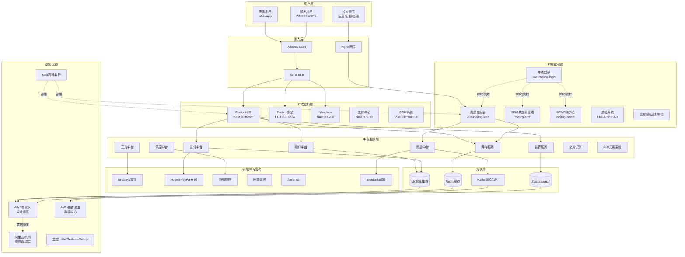

---

## 系统分层架构

### 1. 展示层
```
┌─────────────────────────────────────────────────────────┐
│  C端：Zeelool Web/APP | Vooglam | 支付中心               │
│  B端：魔晶Web/PDA | SRM | HWMS | 质检IPAD                │
└─────────────────────────────────────────────────────────┘
```

### 2. 网关层
```
┌─────────────────────────────────────────────────────────┐
│  CDN: Akamai                                             │
│  负载均衡: AWS ELB                                        │
│  反向代理: Nginx                                          │
│  容器编排: K8S                                            │
└─────────────────────────────────────────────────────────┘
```

### 3. 业务层
```
┌─────────────────────────────────────────────────────────┐
│  C端服务：商城API | 用户接口 | 后台管理                   │
│  B端服务：ERP | WMS | CMS | 定时任务 | 队列处理           │
└─────────────────────────────────────────────────────────┘
```

### 4. 中台/服务层
```
┌─────────────────────────────────────────────────────────┐
│  用户中台 | 支付中台 | 消息中台 | 风控中台                 │
│  库存服务 | 推荐服务 | 三方中台 | AR试戴                  │
└─────────────────────────────────────────────────────────┘
```

### 5. 数据层
```
┌─────────────────────────────────────────────────────────┐
│  MySQL (业务数据) | Redis (缓存) | Elasticsearch (搜索)  │
│  Kafka (消息队列) | S3 (对象存储)                         │
└─────────────────────────────────────────────────────────┘
```

### 6. 基础设施层
```
┌─────────────────────────────────────────────────────────┐
│  云平台: AWS (俄勒冈/弗吉尼亚) + 阿里云 (杭州)            │
│  容器: Amazon EKS | K8S                                  │
│  监控: n9e | Grafana | Sentry | 听云 | Kibana            │
└─────────────────────────────────────────────────────────┘
```

---

## B端系统架构

### 魔晶系列核心架构

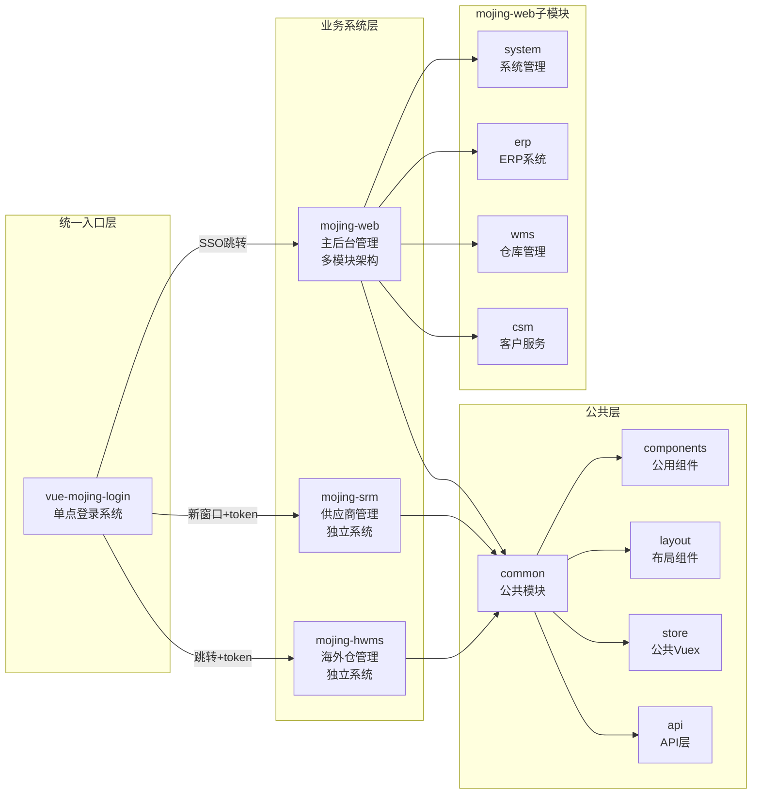

### B端项目清单

| 项目 | 技术栈 | 用途 | 备注 |
|------|--------|------|------|
| **魔晶前端** | Vue 2.6 + Element-UI 2.15.6 | 主后台系统 | ERP、WMS、CSM、System模块 |
| **魔晶质检-IPAD** | UNI-APP + Vue2 + u-view | 仓库质检 | iOS/Android双平台 |
| **SRM系统** | Vue 2.6 + Element-UI | 供应商管理 | 独立系统 |
| **HWMS系统** | Vue 2.6 + Element-UI | 海外仓管理 | 前端项目 |
| **批发站** | Vue2 + Element-UI 2.12 | 小语种批发 | ERP服务 |
| **业财项目** | NetSuite | 财务核算 | 业财系统代码 |
| **车房客户端** | Electron + Vue3 + TS | 车房管理 | 降本项目 |
| **客服第三方应用** | JavaScript | Zendesk应用 | Z站/V站/M站 |
| **Nextmar Order Handler** | Vue2 + Electron | UPS订单处理 | 小魔兽丹阳工具 |
| **魔晶生产数据大屏** | Vue 2.6 + Element-UI | 仓库数据大屏 | 可视化项目 |
| **网红工具[营销系统]** | React 18.2.0 + @zeelool/design | 素材营销管理 | 后台系统 |

### B端用户访问流程

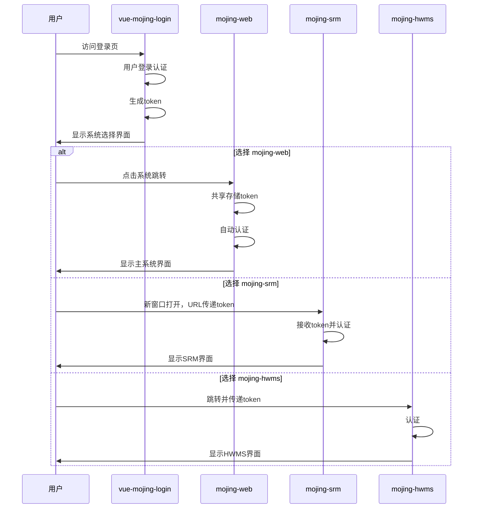

### B端代码结构

```
mojing-web/
├── src/
│   ├── assets/          # 静态资源
│   ├── common/          # 公共模块
│   │   ├── components/  # 公用组件
│   │   ├── layout/      # 布局组件
│   │   ├── store/       # 公共Vuex
│   │   └── api/         # API层
│   ├── modules/
│   │   ├── system/      # 系统管理模块
│   │   ├── erp/         # ERP模块
│   │   ├── wms/         # 仓库管理模块
│   │   └── csm/         # 客户服务模块
│   └── main.js
```

---

## C端系统架构

### C端核心架构

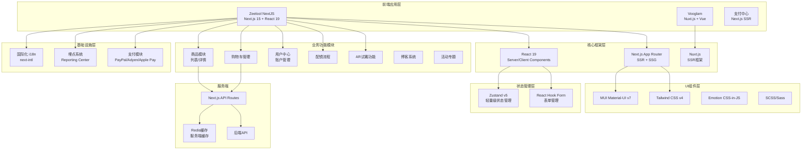

### C端项目清单

| 项目 | 技术栈 | 用途 | 备注 |
|------|--------|------|------|
| **Zeelool Next.js** | Next.js + React + TypeScript | 泽鹿独立站 | 支持US/DE/FR/UK/CA多站 |
| **zeelool-admin-web** | Vue + Element UI | Z站魔方后台 | C端页面数据配置 |
| **vooglam-wap-ssr** | Nuxt.js + Vue | V站WAP端 | 移动端网站 |
| **vooglam-pc-ssr** | Nuxt.js + Vue | V站PC端 | 桌面端网站 |
| **vooglam-admin-web** | Vue + Element UI | V站魔方后台 | 运营管理系统 |
| **crm-admin-web** | Vue + Element UI | CRM系统 | 客户关系管理 |
| **pay-center-ssr** | Next.js + React + TypeScript | 支付路由 | SSR服务 |
| **aws-image-optimization** | Vanilla JS | 图片处理 | AWS图片优化 |

### C端用户访问流程

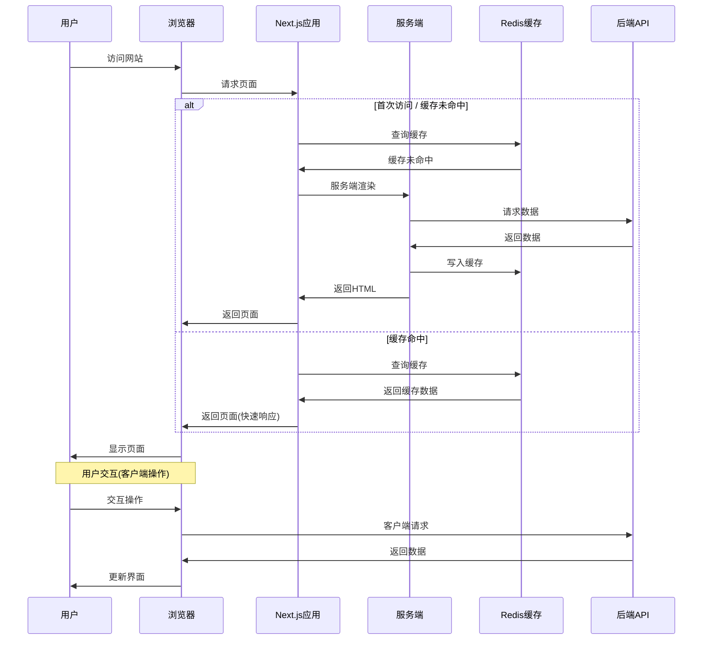

### Zeelool (Next.js) 技术栈详解

#### 核心框架
- **Next.js 15**：App Router、SSR、SSG
- **React 19**：Server Components、Client Components
- **TypeScript 5**：类型安全

#### UI层
- **MUI Material-UI v7**：组件库
- **Tailwind CSS v4**：原子化样式
- **Emotion**：CSS-in-JS
- **SCSS/Sass**：样式预处理器

#### 状态管理
- **Zustand v5**：轻量级状态管理
- **React Hook Form**：表单管理

#### 国际化与埋点
- **next-intl**：国际化
- **Reporting Center**：埋点系统

#### 支付集成
- PayPal
- Adyen
- Apple Pay

---

## 中台服务层

### 中台架构全景

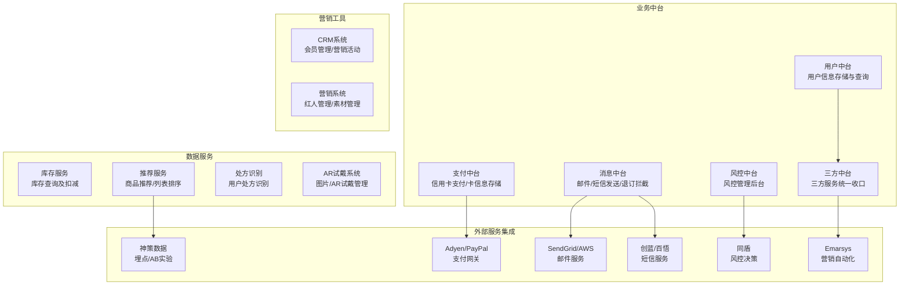

### 中台服务清单

| 中台系统 | 负责人 | 端类型 | 系统职能 | 访问地址 |
|----------|--------|--------|----------|----------|
| **用户中台** | - | C端 | 用户信息存储、查询 | - |
| **支付中台** | 财务 | C端 | 信用卡支付、用户卡信息存储 | admin-pay-center.nextmar.com |
| **消息中台** | - | B/C端 | 邮件、短信发送，退订拦截 | - |
| **风控中台** | 风控产品 | B/C端 | 风控管理后台 | risk.nextmar.com |
| **三方中台** | - | B/C端 | 调用三方服务统一收口（emarsys、instadesk、kmd、shulex、ctiplus等） | - |
| **库存服务** | - | B端 | 网站库存查询及同步扣减 | - |
| **推荐系统** | - | C端 | 多场景商品推荐、列表排序 | - |
| **图片试戴** | 运营 | C端 | 图片试戴管理 | tools.xmslol.com/admin/ar |
| **AR试戴** | 运营 | C端 | AR试戴管理 | tryon.nextmar.com |
| **处方识别** | - | C端 | 用户处方识别服务 | - |
| **企业支付中台** | - | B端 | 提供给魔晶中信司库企业支付对接 | - |
| **CRM系统** | 运营 | C端 | 邮件制作、会员管理（权益、积分配置）、营销活动管理（人群管理，邮件、短信、权益礼包发放） | admin.crm.nextmar.com |
| **营销系统** | 运营 | B端 | 营销设计人员使用，红人管理与素材管理 | admin-marketing-web.nextmar.com |
| **配置中心** | 技术 | C端 | 中台配置中心 Nacos | config.nextmar.com:8848/nacos |
| **业财中间系统** | 财务 | B端 | 按照NetSuite格式聚合魔晶数据，传送NetSuite平台进行财务汇总 | - |

### 三方服务集成

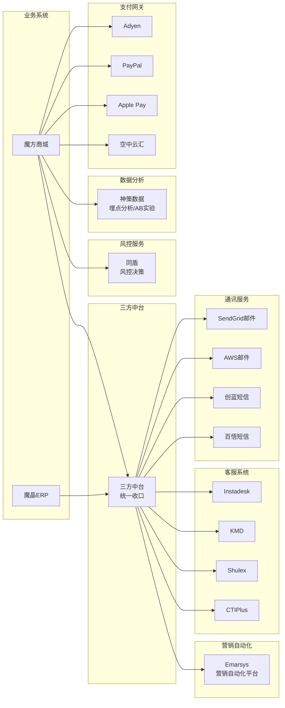

---

## 基础设施层

### 混合云部署架构

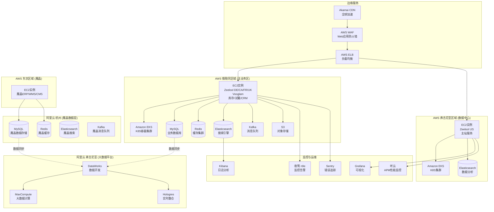

### 物理拓扑详细说明

#### AWS 俄勒冈区域（主业务区）
- **EC2实例**：
  - Zeelool DE/CA/FR/UK 多站点
  - Vooglam API/Admin/Cron/Queue
  - 库存服务、试戴AR、CRM
- **容器编排**：Amazon EKS（K8S集群）
- **数据存储**：
  - MySQL：业务数据库
  - Redis：缓存层
  - Elasticsearch：搜索引擎
  - Kafka：消息队列
- **对象存储**：AWS S3

#### AWS 弗吉尼亚区域（数据中心）
- **EC2实例**：Zeelool US 主站 API/Admin/Cron/Queue
- **容器编排**：Amazon EKS
- **Elasticsearch**：数据分析

#### AWS 东京区域（魔晶业务）
- **EC2实例**：魔晶 ERP/WMS/CMS

#### 阿里云 杭州（魔晶数据层）
- **MySQL**：魔晶数据存储
- **Redis**：魔晶缓存
- **Elasticsearch**：魔晶搜索
- **Kafka**：魔晶消息队列
- **数据同步**：与AWS俄勒冈双向同步

#### 阿里云 弗吉尼亚（大数据平台）
- **DataWorks**：数据开发平台
- **MaxCompute**：大数据计算引擎
- **Hologres**：实时数据仓库
- **数据来源**：从魔晶和魔方同步数据

#### 边缘与网关
- **Akamai CDN**：全球内容分发
- **AWS WAF**：Web应用防火墙
- **AWS ELB**：弹性负载均衡

#### 监控与运维
- **n9e（夜莺）**：监控告警平台
- **Grafana**：可视化监控面板
- **Sentry**：前后端错误追踪
- **Kibana**：日志查询与分析
- **听云**：APM应用性能监控

---

## 技术栈汇总

### 前端技术栈

#### C端前端
| 技术 | 版本 | 应用 |
|------|------|------|
| **Next.js** | 15 | Zeelool主站、支付中心 |
| **React** | 19 | Zeelool、网红工具 |
| **Nuxt.js** | - | Vooglam PC/WAP |
| **Vue** | 2.x | 魔方Admin、CRM Admin |
| **TypeScript** | 5 | Zeelool、支付中心、车房客户端 |
| **MUI** | v7 | Zeelool组件库 |
| **Tailwind CSS** | v4 | Zeelool样式 |
| **Element UI** | - | 魔方Admin、CRM |
| **Zustand** | v5 | Zeelool状态管理 |

#### B端前端
| 技术 | 版本 | 应用 |
|------|------|------|
| **Vue** | 2.6 | 魔晶系列主系统 |
| **Element UI** | 2.15.6 | 魔晶系列UI |
| **UNI-APP** | - | 魔晶质检IPAD |
| **u-view** | - | 质检系统UI |
| **Electron** | - | Nextmar Order Handler、车房客户端 |
| **Vue3** | - | 车房客户端 |

### 后端技术栈

#### 编程语言与框架
- **PHP**：魔方系列主业务（Zeelool、Vooglam）
- **Java**：中台服务（支付、用户、风控等）
- **Node.js**：部分SSR服务（Next.js、Nuxt.js）

#### 数据库
- **MySQL**：主业务数据库
- **Redis**：缓存、会话、队列
- **Elasticsearch**：搜索、日志、数据分析

#### 消息队列
- **Kafka**：异步消息、数据同步

#### 容器与编排
- **Docker**：容器化
- **Kubernetes (K8S)**：容器编排
- **Amazon EKS**：AWS托管K8S

#### 配置与服务治理
- **Nacos**：配置中心（中台使用）

### 基础设施技术栈

#### 云平台
- **AWS**：主业务部署（俄勒冈、弗吉尼亚、东京）
- **阿里云**：魔晶数据层（杭州）、大数据平台（弗吉尼亚）

#### CDN与负载均衡
- **Akamai**：全球CDN
- **AWS ELB**：弹性负载均衡
- **Nginx**：反向代理、负载均衡

#### 监控与日志
- **n9e（夜莺）**：监控告警
- **Grafana**：可视化监控
- **Sentry**：错误追踪
- **Kibana**：日志分析
- **听云**：APM性能监控

#### 大数据
- **DataWorks**：数据开发
- **MaxCompute**：大数据计算
- **Hologres**：实时数仓

---

## 部署拓扑

### 地域分布

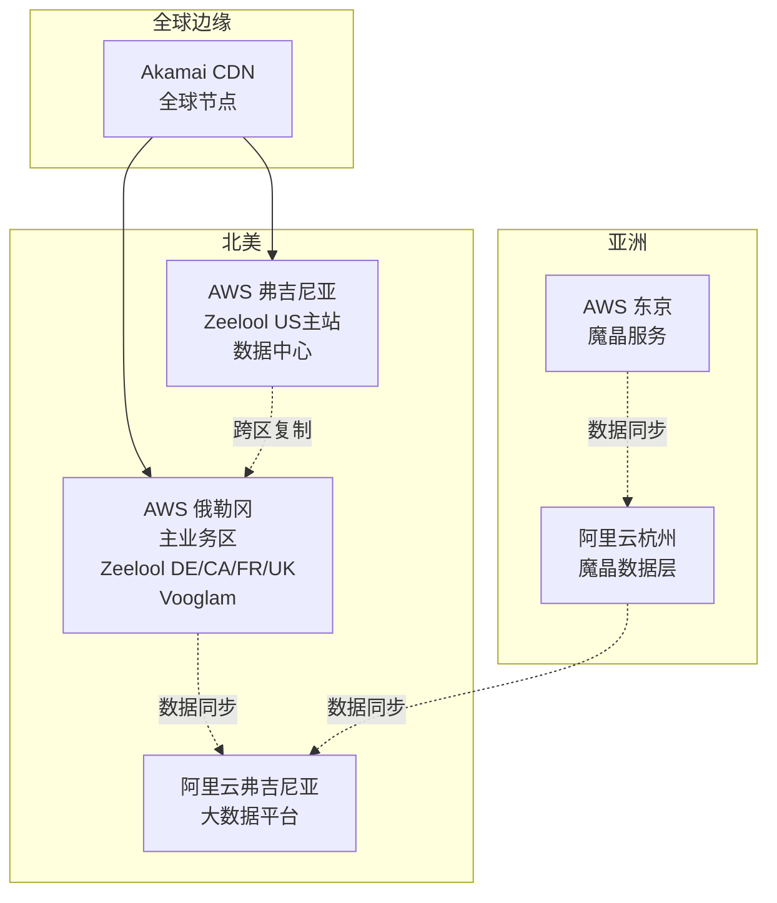

### 网络架构

```
互联网
    │
    ▼
┌─────────────────────────────────────┐
│   Akamai CDN（全球边缘节点）          │
└─────────────────────────────────────┘
    │
    ▼
┌─────────────────────────────────────┐
│   AWS WAF（Web应用防火墙）            │
└─────────────────────────────────────┘
    │
    ▼
┌─────────────────────────────────────┐
│   AWS ELB（弹性负载均衡）             │
└─────────────────────────────────────┘
    │
    ├──────────────┬──────────────┐
    ▼              ▼              ▼
┌────────┐    ┌────────┐    ┌────────┐
│ K8S集群│    │ EC2实例│    │ EC2实例│
│ (俄勒冈)│    │ (弗吉尼亚)│    │ (东京) │
└────────┘    └────────┘    └────────┘
    │              │              │
    ▼              ▼              ▼
┌────────┐    ┌────────┐    ┌────────┐
│数据层   │    │数据层   │    │阿里云  │
│MySQL   │    │MySQL   │    │数据层  │
│Redis   │    │Redis   │    │杭州    │
│ES      │    │ES      │    │        │
│Kafka   │    │        │    │        │
└────────┘    └────────┘    └────────┘
```

---

## 数据流向图

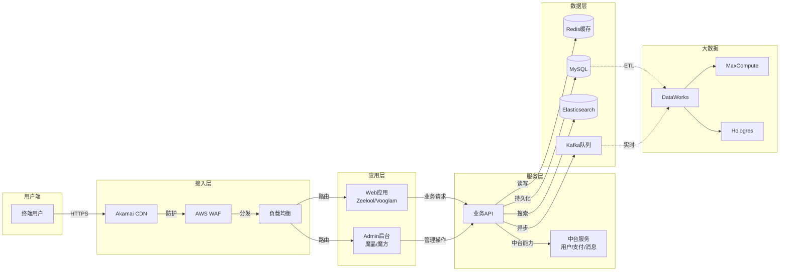

---

## 系统关系图

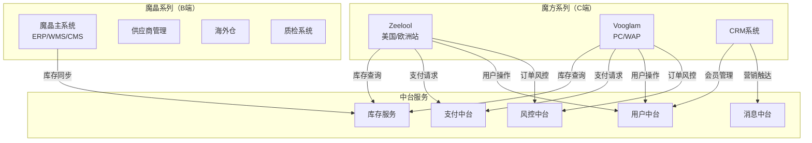

---

## 核心业务流程

### 1. 用户下单流程（C端）

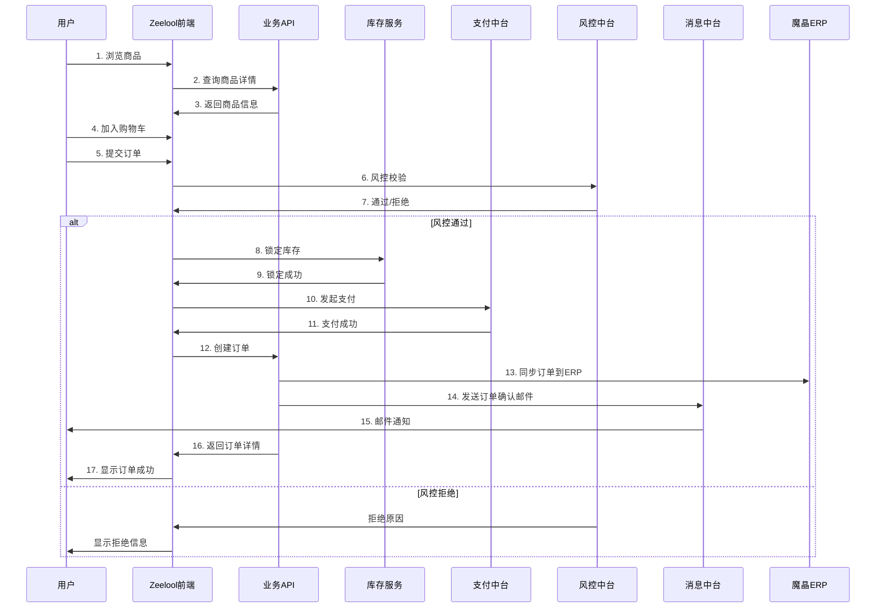

### 2. 仓库发货流程（B端）

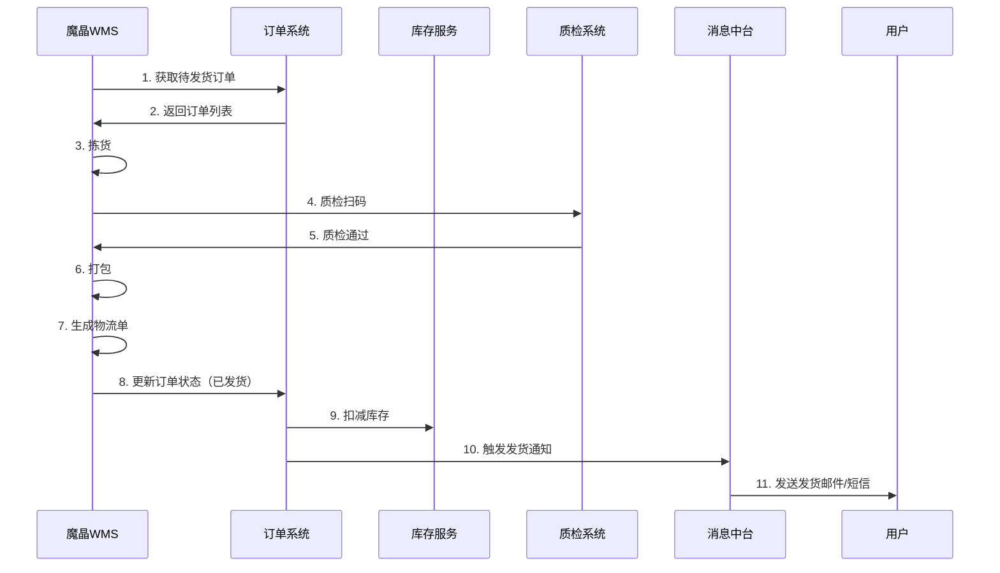

### 3. 供应商下单流程（B端）

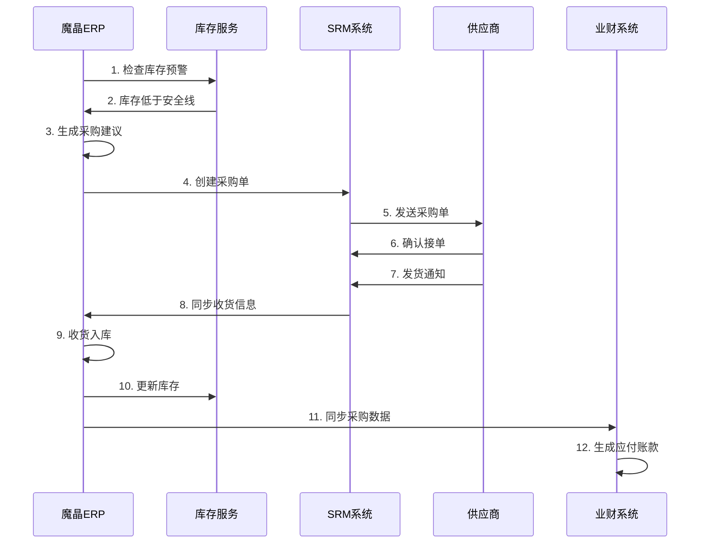

---

## 安全与合规

### 安全架构

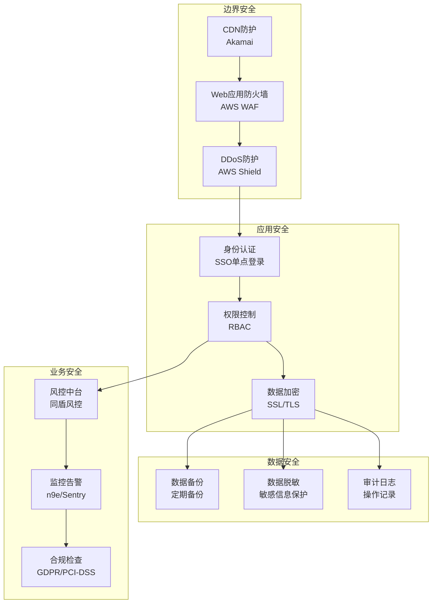

### 数据安全措施

1. **传输加密**：全站HTTPS（SSL/TLS 1.2+）
2. **存储加密**：数据库加密存储、S3服务端加密
3. **访问控制**：
   - B端：SSO单点登录 + RBAC权限控制
   - C端：OAuth 2.0 + JWT Token
4. **敏感数据**：
   - 支付卡信息：PCI-DSS合规存储
   - 用户密码：bcrypt加密
   - 处方图片：OCR处理后加密存储
5. **审计日志**：所有关键操作记录审计日志
6. **数据备份**：
   - MySQL：每日全量备份 + 增量备份
   - Redis：RDB + AOF持久化
   - S3：跨区域复制

### 合规要求

- **GDPR**（欧盟）：用户数据保护、数据删除权
- **PCI-DSS**：支付卡行业数据安全标准
- **CCPA**（加州）：消费者隐私保护

---

## 监控与运维

### 监控体系

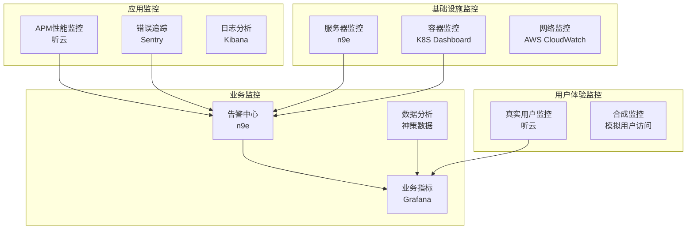

### 监控指标

#### 应用层
- **响应时间**：P50、P95、P99
- **吞吐量**：QPS、TPS
- **错误率**：5xx、4xx错误比例
- **可用性**：SLA 99.9%

#### 基础设施层
- **CPU使用率**：< 70%
- **内存使用率**：< 80%
- **磁盘IO**：IOPS、吞吐量
- **网络流量**：带宽使用率

#### 业务层
- **订单转化率**
- **支付成功率**
- **库存准确率**
- **用户活跃度**

### 告警策略

| 级别 | 条件 | 响应时间 | 通知方式 |
|------|------|----------|----------|
| **P0** | 服务全局不可用 | 立即 | 电话 + 短信 + 邮件 |
| **P1** | 核心功能异常 | 5分钟 | 短信 + 邮件 |
| **P2** | 性能下降 | 15分钟 | 邮件 + 企业微信 |
| **P3** | 资源预警 | 30分钟 | 邮件 |

---

## 性能优化

### 前端优化

1. **代码分割**：React/Vue路由懒加载
2. **资源优化**：
   - 图片：WebP格式、懒加载、CDN
   - 字体：font-display: swap
   - CSS/JS：Tree Shaking、压缩、Gzip
3. **缓存策略**：
   - 静态资源：强缓存（max-age=1年）
   - API：协商缓存（ETag）
4. **SSR**：Next.js/Nuxt.js服务端渲染
5. **CDN**：Akamai全球加速

### 后端优化

1. **数据库优化**：
   - 索引优化：覆盖索引、联合索引
   - 查询优化：避免N+1、使用EXPLAIN分析
   - 分库分表：订单表按月分表
2. **缓存策略**：
   - Redis缓存热点数据
   - 多级缓存：浏览器 → CDN → Redis → MySQL
3. **异步处理**：
   - Kafka消息队列处理耗时任务
   - 定时任务：订单超时取消、库存同步
4. **API优化**：
   - GraphQL：减少过度获取
   - 批量接口：减少请求次数
5. **服务降级**：
   - 推荐服务降级：返回默认推荐
   - AR试戴降级：返回静态图片

### 架构优化

1. **微服务化**：中台服务独立部署
2. **容器化**：K8S自动扩缩容
3. **读写分离**：MySQL主从复制
4. **分布式缓存**：Redis集群
5. **CDN加速**：静态资源全球分发

---

## 灾难恢复

### 备份策略

| 数据类型 | 备份频率 | 保留时间 | 存储位置 |
|----------|----------|----------|----------|
| **MySQL** | 每日全量 + 实时增量 | 30天 | AWS S3 + 异地 |
| **Redis** | 每小时RDB | 7天 | 本地 + S3 |
| **Elasticsearch** | 每日快照 | 14天 | S3 |
| **代码仓库** | 实时 | 永久 | 云效Git |
| **配置文件** | 变更时 | 永久 | 版本控制 |

### 容灾方案

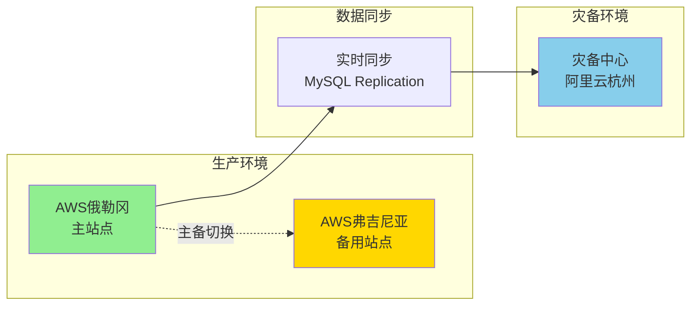

### RTO/RPO 目标

| 系统 | RTO（恢复时间目标） | RPO（数据丢失容忍） |
|------|---------------------|---------------------|
| **魔方商城** | < 1小时 | < 5分钟 |
| **魔晶ERP** | < 2小时 | < 15分钟 |
| **支付中台** | < 30分钟 | 0（实时同步） |
| **中台服务** | < 1小时 | < 10分钟 |

---

## 技术债务与优化方向

### 当前技术债务

1. **前端技术栈不统一**：
   - B端：Vue 2.6（已停止维护）
   - C端：React 19（最新） + Vue2（历史包袱）
   - **建议**：统一升级到Vue 3或React 18+

2. **部分系统架构老旧**：
   - 批发站、业财项目技术栈陈旧
   - **建议**：重构或迁移到现代架构

3. **海外仓系统废弃**：
   - mojing-hwms标记为废弃但未完全下线
   - **建议**：彻底下线或重新规划

4. **DMP功能废弃**：
   - 除邮件打开统计外其余功能已废弃
   - **建议**：下线或整合到其他系统

5. **红人管理后台重复**：
   - 两个红人管理系统（cp.xmslol.com和cmp.nextmar.com）
   - **建议**：合并为一个系统

### 优化方向

#### 短期（0-6个月）
1. **Vue 2升级到Vue 3**：魔晶系列前端升级
2. **性能优化**：首屏加载时间优化、API响应时间优化
3. **监控完善**：补齐业务监控指标、告警规则优化
4. **文档完善**：API文档、运维文档、架构文档

#### 中期（6-12个月）
1. **微服务改造**：单体应用拆分为微服务
2. **容器化改造**：全面容器化部署
3. **数据中台建设**：统一数据模型、数据治理
4. **自动化测试**：单元测试覆盖率 > 70%

#### 长期（12个月+）
1. **Serverless架构**：部分服务迁移到Serverless
2. **边缘计算**：CDN边缘节点计算能力
3. **AI应用**：商品推荐、智能客服、图像识别
4. **国际化扩展**：支持更多国家和地区

---

## 附录

### 系统职能详细说明

#### 魔晶（B端）
- **用户**：运营、客服等内部人员
- **系统职能**：
  - 财务管理
  - 供应链管理
  - 供应商管理
  - 客服模块
  - 仓库管理
  - 质检系统
- **使用地点**：郑州、杭州、丹阳、美国等
- **多端支持**：Pad、PDA、PC

#### 魔方（C端）
- **用户**：运营人员
- **系统职能**：
  - Zeelool商城（US、DE、UK、FR、CA）
  - Vooglam商城
  - 商城测与后台管理

#### CRM系统
- **用户**：运营人员
- **访问地址**：https://admin.crm.nextmar.com/
- **系统职能**：
  - 邮件制作
  - 会员管理（权益、积分配置）
  - 营销活动管理（人群管理）
  - 邮件、短信、权益礼包发放

#### 支付中台
- **用户**：财务
- **访问地址**：https://admin-pay-center.nextmar.com/
- **系统职能**：
  - 信用卡支付
  - 用户卡信息存储

### 关键URL清单

| 系统 | URL | 用途 |
|------|-----|------|
| CRM | https://admin.crm.nextmar.com/ | 客户关系管理 |
| 支付中台 | https://admin-pay-center.nextmar.com/ | 支付管理 |
| 风控中台 | https://risk.nextmar.com/ | 风控管理 |
| 营销系统 | https://admin-marketing-web.nextmar.com/ | 红人管理/素材管理 |
| AR试戴管理 | https://tools.xmslol.com/admin/ar | 图片试戴管理 |
| AR试戴 | https://tryon.nextmar.com/OjBbRgwAIl.php | 试戴管理 |
| 配置中心 | http://config.nextmar.com:8848/nacos | Nacos配置 |
| 爬虫管理 | https://cp.xmslol.com/admin | 已废弃 |
| 红人管理 | https://ic.xmslol.com/ORHwyCtjiD.php/index/index | - |
| 红人管理2 | https://cmp.nextmar.com/ORHwyCtjiD.php/celebrity/index2 | - |

### 团队与负责人

| 系统 | 负责人/团队 |
|------|-------------|
| 魔晶系列 | B端团队 |
| 魔方系列 | C端团队 |
| CRM系统 | 运营团队 |
| 支付中台 | 财务团队 |
| 风控中台 | 风控产品团队 |
| 营销系统 | 运营团队 |
| 图片试戴/AR试戴 | 运营团队 |
| 配置中心 | 技术团队 |
| 业财中间系统 | 财务团队 |

---

## 总结

本系统是一个**典型的跨境电商全栈平台**，具备以下特点：

### 架构特点
1. **前后端分离**：C端Next.js/Nuxt.js，B端Vue 2.6
2. **微服务架构**：中台服务独立部署
3. **混合云部署**：AWS + 阿里云
4. **多站点支持**：美国、欧洲多国站点
5. **容器化**：K8S容器编排

### 技术优势
1. **高性能**：CDN加速、Redis缓存、SSR
2. **高可用**：多活部署、负载均衡、容灾备份
3. **可扩展**：微服务、消息队列、水平扩展
4. **安全合规**：PCI-DSS、GDPR、风控中台

### 业务价值
1. **B端赋能**：ERP/WMS/CMS全流程数字化
2. **C端体验**：多站点、多语言、个性化推荐
3. **中台支撑**：用户、支付、消息、风控共享服务
4. **数据驱动**：大数据平台、埋点分析、AB实验

---

**文档版本**：v1.0  
**生成日期**：2026-02-06  
**维护人**：贾维斯 🤖  
**更新周期**：随架构变更实时更新
